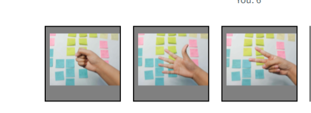
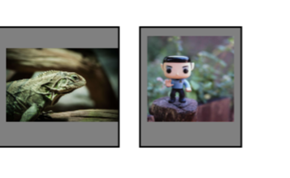
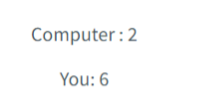
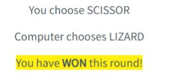

# Rock, Paper, Scissor, Lizard, Spock Javascript Game

My 2nd website is a classic game, rock paper scissor, but an extended version of it with lizard and spock (Big Bang Theory). The main goal for the website/game is to let the visitors play this easy, classic game and let them enjoy. It's a one-page website design with 5 buttons and made with javascript, html and css.

## Features

### Rock, Paper, Scissor Buttons

I initially wanted to make an easy rock, paper scissor game, the goal of it was to make the user play rock paper scissors.

### Extended with Lizard, Spock Buttons

However, I thought visitors would enjoy more and keep playing if I extend the game with 2 more buttons.

### Your Score

Added Javascript to see who wins and if you win increase your win score by +1. Used a google font via @import function.

### Computer Score

The computer automatically chooses a random button. this was done with math.floor and math.random. We also calculate their wins.

### Lost/ Won 

Beneat the buttons there is a text which let the user know if they have lost, won or tied, with their button they chose and the computer chosen button for that round.

### Features left to implement

-Make the amount of losses visible, your losses aswell as computer losses.
- Do a max amount of rounds, for example 5 and a button to restart the game/ webpage or quit the game / webpage.

## Unfixed Bugs

No Bugs as far as is known.

## Testing
Lighthouse performance test -

https://web.dev/measure/?url=https%3A%2F%2Fjouryk0rt.github.io%2Frock-paper-scissors-game%2F

W3C CSS Validator - No Errors found
https://jigsaw.w3.org/css-validator/validator?uri=https%3A%2F%2Fjouryk0rt.github.io%2Frock-paper-scissors-game%2F&profile=css3svg&usermedium=all&warning=1&vextwarning=&lang=nl

Validator W3 (HTML) - Document checking completed. No errors or warnings to show.
https://validator.w3.org/nu/?doc=https%3A%2F%2Fjouryk0rt.github.io%2Frock-paper-scissors-game%2F

## Manual Testing
Developer tools - tried resizing it to different sizes, all looks good. Page loads fast because of compromised images and everything works as intended.

Am I Responsive https://ui.dev/amiresponsive - Put it through this website, and looks good on all screen sizes.

## Deployment
The site was deployed to GitHub pages. The steps to deploy are as follows:
In the GitHub repository, navigate to the Settings tab.
On the left menu, under the "Code & Automation tab" go to "Pages".
Put the source on main and keep the folder on root (/)
Then Press save, it can take some time for the webpage to be live.
If the website is not live after 15mins, there may be something going on with the github status.
 check it out here: https://www.githubstatus.com/
The live link of this project be found here - https://jouryk0rt.github.io/rock-paper-scissors-game/

## Credits
### Content
I have written the content and gather the images through these sources:
Love Maths Project
https://www.youtube.com/watch?v=Iwvf9iBP04M&t=530s used this code for some of the javascript part

### Images

Photo by <a href="https://unsplash.com/es/@imanitor?utm_source=unsplash&utm_medium=referral&utm_content=creditCopyText">Fadilah Im</a> on <a href="https://unsplash.com/s/photos/rock-paper-scissors?utm_source=unsplash&utm_medium=referral&utm_content=creditCopyText">Unsplash</a>
  
Photo by <a href="https://unsplash.com/es/@imanitor?utm_source=unsplash&utm_medium=referral&utm_content=creditCopyText">Fadilah Im</a> on <a href="https://unsplash.com/s/photos/rock-paper-scissors?utm_source=unsplash&utm_medium=referral&utm_content=creditCopyText">Unsplash</a>
  
Photo by <a href="https://unsplash.com/es/@imanitor?utm_source=unsplash&utm_medium=referral&utm_content=creditCopyText">Fadilah Im</a> on <a href="https://unsplash.com/s/photos/rock-paper-scissors?utm_source=unsplash&utm_medium=referral&utm_content=creditCopyText">Unsplash</a>

Photo by <a href="https://unsplash.com/@tomexx?utm_source=unsplash&utm_medium=referral&utm_content=creditCopyText">Tomáš Lištiak</a> on <a href="https://unsplash.com/s/photos/2d-lizard?

Afbeelding van <a href="https://pixabay.com/nl/users/brenkee-2021352/?utm_source=link-attribution&amp;utm_medium=referral&amp;utm_campaign=image&amp;utm_content=1541528">Benjamin Balazs</a> via <a href="https://pixabay.com/nl//?utm_source=link-attribution&amp;utm_medium=referral&amp;utm_campaign=image&amp;utm_content=1541528">Pixabay</a>utm_source=unsplash&utm_medium=referral&utm_content=creditCopyText">Unsplash</a>

### Code from others (rewritten)
https://www.youtube.com/watch?v=Iwvf9iBP04M&t=530s used this code for some of the javascript part

used the body styling from the Love Maths project

https://www.youtube.com/watch?v=RwFeg0cEZvQ - Used this only for research on similiar Javascript

https://www.youtube.com/watch?v=fIBOydve2f8 - Used this also only for research on similiar Javascript
